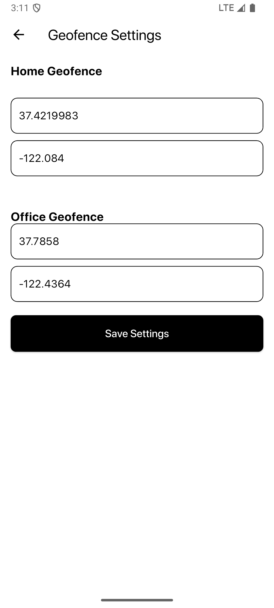

# Flutter Geofencing and Location Tracking App


## Overview

This Flutter application implements a  geofencing and location tracking solution. The app tracks user location in real-time and categorizes their time spent at "Home," "Office," or "Traveling." Daily summaries of the tracked time are stored using Hive and can be reviewed via an interactive calendar interface.

## Features

- **Real-Time Location Tracking:**  
  Uses device GPS to continuously track the user's location in the background.

- **Dynamic Geofencing:**  
  - Sets up two geofences ("Home" and "Office").  
  - Allows users to manually configure these geofences via a settings screen.
  - Determines if the user is inside a geofence or traveling.

- **Time Accumulation:**  
  Accumulates the total time spent within each geofence and while traveling.

- **Daily Summary:**  
  Stores daily summaries using Hive. Users can review past summaries via a sliding calendar interface.

- **Status Display:**  
  A dedicated widget shows the current geofence status with a circular progress indicator, displaying:
  - The remaining distance to exit a geofence.
  - The distance to the nearest geofence if traveling.
  - A text status indicating "at Home," "at Office," or "Traveling."

## Architecture

The application is built using a clean architecture approach, with clear separation into the following layers:

- **Models:**  
  - `GeoFence`: Represents geofence parameters (latitude, longitude, radius).  
  - `DailySummary`: Stores daily tracking data with Hive annotations.

- **Services:**  
  - **LocationService:** Integrates with `flutter_background_geolocation` and `geolocator` to manage real-time location tracking and geofence events.  
  - **GeoFenceService:** Provides helper functions to calculate distances and verify geofence membership.

- **Providers:**  
  - **LocationTrackingProvider:** Manages tracking state, communicates with LocationService, and persists daily summaries to Hive.

- **UI Screens:**  
  - **MainScreen:** Contains "Clock In" and "Clock Out" buttons and navigation to Settings and Summary screens.
  - **SettingsScreen:** Allows users to set custom geofence coordinates. Settings are persisted using Hive.
  - **SummaryScreen:** Displays daily summaries with a sliding calendar for navigation.
  - **GeofenceStatusWidget:** Provides real-time feedback on the user's proximity to geofences.

- **Utilities:**  
  - Helper functions and a logging utility that standardizes formatting and logs messages for debugging.

## Installation

1. **Clone the Repository:**
   ```bash
   git clone https://github.com/yourusername/your-repo-name.git
   cd your-repo-name
   ```

2. **Install Dependencies:**
   ```bash
   flutter pub get
   ```

3. **Set Up Hive:**
   Ensure that Hive boxes are opened in `main.dart`:
   ```dart
   await Hive.initFlutter();
   Hive.registerAdapter(DailySummaryAdapter());
   await Hive.openBox<DailySummary>('dailySummaries');
   await Hive.openBox("geofenceSettings");
   ```

4. **Configure API Keys:**
   In your `AndroidManifest.xml`, replace the placeholder license keys with your actual keys:
   ```xml
   <meta-data android:name="com.transistorsoft.locationmanager.license" android:value="YOUR_LICENSE_KEY_HERE" />
   <meta-data android:name="com.transistorsoft.locationmanager.hms.license" android:value="YOUR_LICENSE_KEY_HERE" />
   <meta-data android:name="com.transistorsoft.locationmanager.polygon.license" android:value="YOUR_LICENSE_KEY_HERE" />
   ```

5. **Build the App:**
   For a debug build:
   ```bash
   flutter run
   ```
   For a release build:
   ```bash
   flutter build apk --release
   ```

## Screenshots

### Main Screen


*The Main Screen displays "Clock In" and "Clock Out" buttons, and provides navigation to the settings and summary screens.*

### Settings Screen



*The Settings Screen allows users to input and save custom geofence coordinates for Home and Office.*

### Summary Screen


*The Summary Screen features a sliding calendar interface to view daily summaries of time spent at Home, Office, or Traveling.*

### Geofence Status


*The Geofence Status Widget shows real-time feedback with a circular progress indicator, displaying the distance remaining until leaving a geofence or distance to the nearest geofence if traveling.*

## License

This project is licensed under the MIT License. See the [LICENSE](LICENSE) file for details.

## Acknowledgements

- [flutter_background_geolocation](https://pub.dev/packages/flutter_background_geolocation) by Transistor Software  
- [Hive](https://pub.dev/packages/hive) for local storage  
- [TableCalendar](https://pub.dev/packages/table_calendar) for calendar UI  
- [Provider](https://pub.dev/packages/provider) for state management


