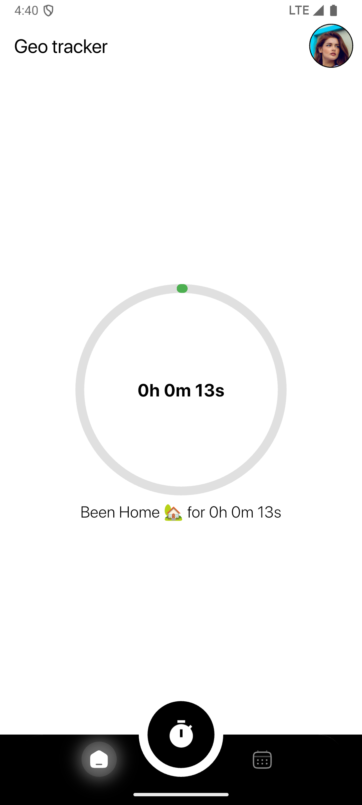

# Flutter Geofencing and Location Tracking App


## Overview

This Flutter application implements a production-ready geofencing and location tracking solution. The app tracks the user’s location in real time, categorizes the time spent at **Home**, **Office**, or while **Traveling**, and persists daily summaries using Hive. Users can configure geofence parameters via a settings screen, view daily summaries through an interactive sliding calendar, and monitor real-time geofence status.

**Key Feature:**  
Even when the app is minimized or terminated, the Clock In service continues running in the background, ensuring that tracking remains uninterrupted.

---

## Features

- **Real-Time Location Tracking:**  
  Continuously tracks the user’s location, even in the background or when the app is minimized.

- **Dynamic Geofencing:**  
  - Supports two configurable geofences: **Home** and **Office**.
  - Users can set these geofences manually via the Settings Screen.
  - If the user is outside both geofences, the app tracks time spent while traveling.

- **Time Accumulation:**  
  Accumulates the total time spent in each zone (Home, Office, Traveling).

- **Daily Summaries:**  
  Stores daily tracking summaries using Hive. Users can review these summaries via an interactive calendar that slides away (using a sliver layout) to reveal more detailed information.

- **Real-Time Status Display:**  
  A dedicated widget shows the current geofence status with a circular progress indicator, displaying:
  - The remaining distance until leaving a geofence (if inside).
  - The distance to the nearest geofence (if traveling).
  - A text label indicating whether the user is at Home, in Office, or traveling.

- **Robust Lifecycle Management:**  
  The background geolocation service continues to run when the app is minimized or even terminated. Proper lifecycle handling ensures that tracking is never interrupted.

---

## Architecture

The application is structured using a clean, modular architecture:

- **Models:**
  - **GeoFence:** Defines geofence parameters (name, latitude, longitude, radius).
  - **DailySummary:** A Hive-annotated model that stores the total time (in seconds) spent in each zone for a given day.

- **Services:**
  - **Geo-Fence Service:** Provides helper methods to calculate distances and determine geofence membership.
  - **Location Service:**  
    - Integrates with `flutter_background_geolocation` and `geolocator` to continuously fetch the device’s location.
    - Dynamically adds and monitors geofences.
    - Uses a periodic timer and event callbacks to update tracking data.
    - Handles background lifecycle events so that tracking continues when the app is minimized or closed.

- **Providers:**
  - **LocationTrackingProvider:**  
    Manages application state, controls when tracking starts and stops, loads saved geofence settings from Hive, and persists daily summaries. It ensures that any location changes trigger UI updates through Provider’s notification mechanism.

- **UI Screens:**
  - **MainScreen:**  
    Contains “Clock In” and “Clock Out” buttons (implemented with custom reusable buttons) and provides navigation to Settings and Summary screens.
  - **SettingsScreen:**  
    Allows users to input and persist custom geofence coordinates for Home and Office using Hive.
  - **SummaryScreen:**  
    Displays daily summaries via a sliding calendar (using `table_calendar: ^3.2.0` in a sliver layout) and shows detailed time spent for the selected day.
  - **GeofenceStatusWidget:**  
    Provides real-time feedback on the current geofence status (distance, progress, and zone) using a circular percent indicator.

- **Utilities:**
  - **Helpers:**  
    Contains static utility functions (e.g., formatting durations and converting dates to keys).
  - **Logger:**  
    Wraps the `logger` package to provide consistent, structured logging across the app.

- **Persistence:**
  - **Hive:**  
    - Stores daily summaries in the `"dailySummaries"` box.
    - Persists geofence settings in the `"geofenceSettings"` box.
    - Hive adapters are registered and boxes are opened during app initialization.

---

## Lifecycle Management

The application is designed so that the tracking service remains active regardless of the app’s state:

- **Background Operation:**  
  The `flutter_background_geolocation` plugin is configured with `stopOnTerminate: false` and `startOnBoot: true`. This ensures that even if the app is terminated, the background service continues running, and location tracking persists.

- **Provider & Service Integration:**  
  The provider and location service call `notifyListeners()` on significant lifecycle events (e.g., when a new location is fetched). This guarantees that the UI, such as the GeofenceStatusWidget, updates in real time.

- **Resilience:**  
  The service uses methods like `fetchInitialLocation()` during Clock In to ensure the most recent location is used immediately upon starting tracking.

---

## Installation

1. **Clone the Repository:**
   ```bash
   git clone https://github.com/yourusername/your-repo-name.git
   cd your-repo-name
   ```

2. **Install Dependencies:**
   ```bash
   flutter pub get
   ```

3. **Set Up Hive:**
   Ensure that Hive boxes are opened in `main.dart`:
   ```dart
   await Hive.initFlutter();
   Hive.registerAdapter(DailySummaryAdapter());
   await Hive.openBox<DailySummary>('dailySummaries');
   await Hive.openBox("geofenceSettings");
   ```

4. **Configure API Keys & Licensing:**
   In your `AndroidManifest.xml`, replace placeholder license keys with your actual Transistorsoft license keys:
   ```xml
   <meta-data android:name="com.transistorsoft.locationmanager.license" android:value="YOUR_LICENSE_KEY_HERE" />
   <meta-data android:name="com.transistorsoft.locationmanager.hms.license" android:value="YOUR_LICENSE_KEY_HERE" />
   <meta-data android:name="com.transistorsoft.locationmanager.polygon.license" android:value="YOUR_LICENSE_KEY_HERE" />
   ```

5. **Build the App:**
   For debug:
   ```bash
   flutter run
   ```
   For release:
   ```bash
   flutter build apk --release
   ```

---

## Screenshots

### Main Screen

  
*Clock In/Clock Out buttons with navigation to Settings and Summary screens.*

### Settings Screen

  
*Configure custom geofence coordinates for Home and Office.*

### Summary Screen

  
*View daily summaries with an interactive sliding calendar interface.*

### Geofence Status

  
*Real-time display of geofence status with a circular progress indicator showing the distance remaining or distance from the geofence.*

---

## License

This project is licensed under the MIT License. See the [LICENSE](LICENSE) file for details.

## Acknowledgements

- [flutter_background_geolocation](https://pub.dev/packages/flutter_background_geolocation) by Transistor Software  
- [Hive](https://pub.dev/packages/hive) for local storage  
- [TableCalendar](https://pub.dev/packages/table_calendar) for calendar UI  
- [Provider](https://pub.dev/packages/provider) for state management

---

